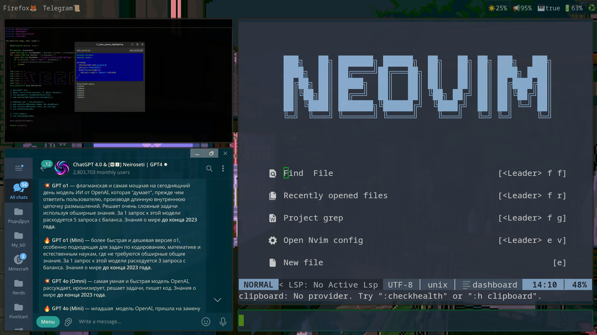

# Welcome!

This is my personal configuration for my Arch Linux system, featuring:

- Hyprland Environment
- Neovim IDE
- Kitty Terminal with Fish Shell
- Custom Waybar with Personal/GPT Scripts
- All Necessary Packages

I created this repository for myself and anyone else who might have questions. Feel free to reach out to me on Telegram: [@RE_zeroTWO20sm](https://t.me/RE_zeroTWO20sm).

I'm a novice in this area, but I'm happy to provide assistance where I can.

## Special Thanks

1. [JDhao's Neovim Config](https://github.com/jdhao/nvim-config): I used and modified this for Arch compatibility.
2. [@ChatGPT_General_Bot on Telegram](https://t.me/ChatGPT_General_Bot): As a Russian speaker, this bot was invaluable for understanding English.
3. Mugivara: My friend who introduced me to Hyprland.
4. Vekus: My friend who informed me about Vim.

## Workflow Showcase

For a visual overview, check out my [YouTube video](https://youtu.be/zrWrCL8BrZI).

---
# Overview

